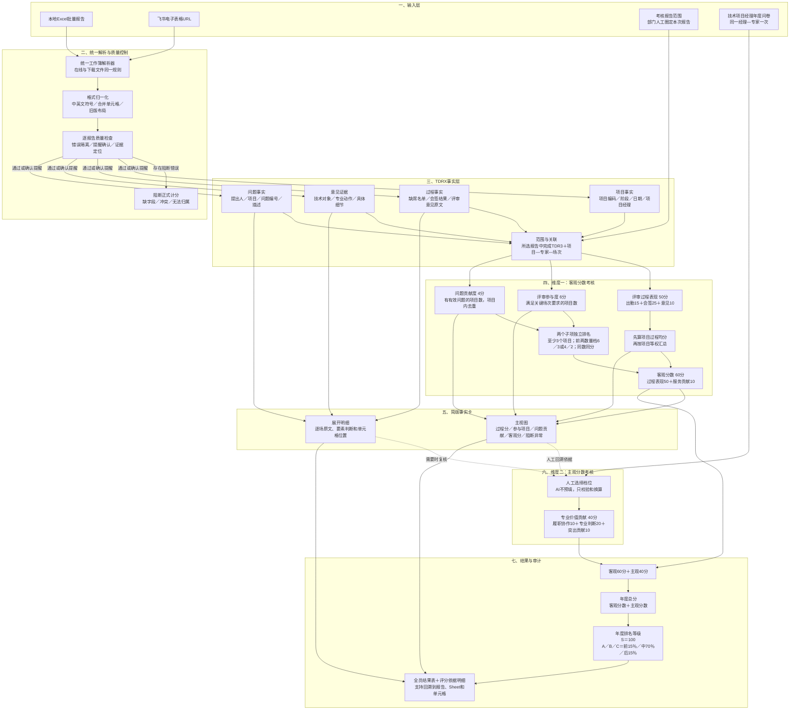

# TDT评审专家年度打分系统架构图（草稿V0.1）

```mermaid
flowchart TB
    subgraph I[一、输入层]
        I1[本地Excel批量报告]
        I2[飞书电子表格URL]
        I3[考核报告范围<br/>部门人工圈定本次报告]
        I4[技术项目经理年度问卷<br/>同一经理—专家一次]
    end

    subgraph P[二、统一解析与质量控制]
        P1[统一工作簿解析器<br/>在线与下载文件同一规则]
        P2[格式归一化<br/>中英文符号／合并单元格／旧版布局]
        P3[逐报告质量检查<br/>错误隔离／提醒确认／证据定位]
        PX[阻断正式计分<br/>缺字段／冲突／无法归属]
    end

    subgraph F[三、TDRX事实层]
        F1[项目事实<br/>项目编码／阶段／日期／项目经理]
        F2[过程事实<br/>缺席名单／会签结果／评审意见原文]
        F3[意见证据<br/>技术对象／专业动作／具体细节]
        F4[问题事实<br/>提出人／项目／问题编号／描述]
        F5[范围与关联<br/>所选报告中完成TDR3＋项目—专家—场次]
    end

    subgraph O[四、维度一：客观分数考核]
        O1[评审过程表现 50分<br/>出勤15＋会签25＋意见10]
        O2[先算项目过程均分<br/>再按项目等权汇总]
        O3[评审参与度 6分<br/>满足关键场次要求的项目数]
        O4[问题贡献度 4分<br/>有有效问题的项目数，项目内去重]
        O5[两个子项独立排名<br/>至少3个项目；前两数量档6／3或4／2；同数同分]
        O6[客观分数 60分<br/>过程表现50＋服务贡献10]
    end

    subgraph C[五、简版事实卡]
        C1[主视图<br/>过程分／参与项目／问题贡献／客观分／阻断异常]
        C2[展开明细<br/>逐场原文、要素判断和单元格位置]
    end

    subgraph S[六、维度二：主观分数考核]
        S1[专业价值贡献 40分<br/>履职协作10＋专业判断20＋突出贡献10]
        S2[人工选择档位<br/>AI不预填，只校验和换算]
    end

    subgraph R[七、结果与审计]
        R1[客观60分＋主观40分]
        R2[年度总分<br/>客观分数＋主观分数]
        R3[年度排名等级<br/>S＝100<br/>A／B／C＝前15％／中70％／后15％]
        R4[全员结果表＋评分依据明细<br/>支持回溯到报告、Sheet和单元格]
    end

    I1 --> P1
    I2 --> P1
    P1 --> P2 --> P3
    P3 -->|存在阻断错误| PX
    P3 -->|通过或确认提醒| F1
    P3 -->|通过或确认提醒| F2
    P3 -->|通过或确认提醒| F3
    P3 -->|通过或确认提醒| F4
    I3 --> F5
    F1 --> F5
    F2 --> F5
    F3 --> F5
    F4 --> F5

    F5 --> O1 --> O2 --> O6
    F5 --> O3 --> O5 --> O6
    F5 --> O4 --> O5

    O2 --> C1
    O3 --> C1
    O4 --> C1
    O6 --> C1
    F2 --> C2
    F3 --> C2
    F4 --> C2

    I4 --> S2 --> S1
    C1 -.人工回溯依据.-> S2
    C2 -.需要时复核.-> S2

    O6 --> R1
    S1 --> R1 --> R2 --> R3 --> R4
    C1 --> R4
    C2 --> R4
```
