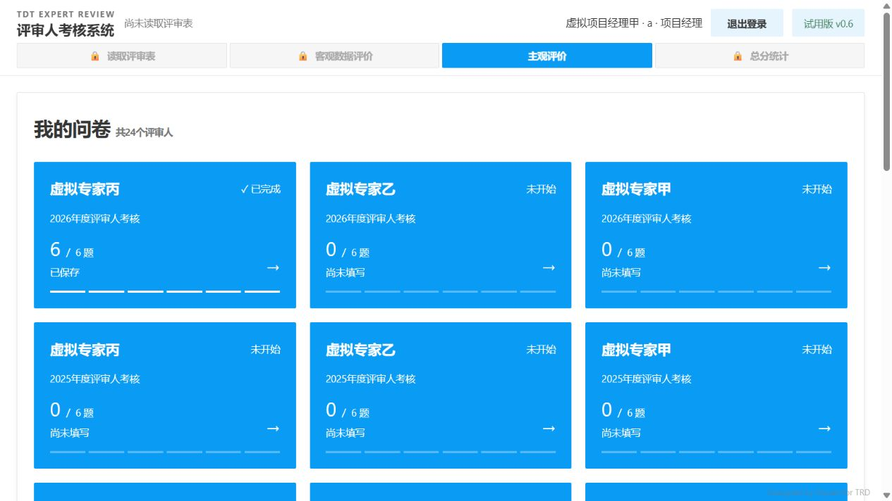
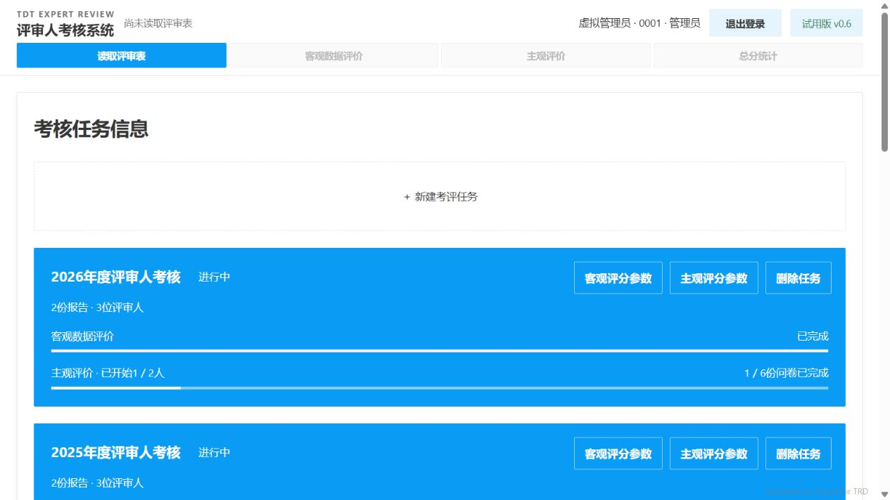

# 正式卡片、保存状态与导出入口验收

2026-09-28，本机main，构建`a52b09d58b353060`。本轮基于用户确认的V2差异修改正式界面，未修改Excel生成内容、评分公式或正式运行数据。

## 实现

- 项目经理问卷列表采用三列蓝底白字整卡入口，窄屏依次两列／一列，显示完成状态及六题进度。保留考核周期用于区分跨期任务。
- 已建管理员任务采用标准主题蓝、白字和白色进度条。新建任务继续白底虚线；独立客观／主观参数入口保留。卡片采用180ms、悬停上移3px、亮度0.94及既定按压反馈；尊重减少动效设置。
- 退出登录与试用版均为104×40，保留彩色锁图标和后台权限校验。
- 删除仍先二次确认，服务端成功后只移除对应卡片，不刷新整页；焦点恢复禁止滚动，下方卡片180ms补位，页面底部按剩余高度自然回收。
- 客观导出仅显示在客观打分页；主观两页取消独立导出；总分统计导出保留。现有Excel字段、列序和表内容均未修改，后续另行讨论。
- 后台保存期间允许继续填答，重绘不会把问卷禁用；保存结束恢复正确的可编辑／只读状态，保留提交中新增修改及失败草稿。

## 验证结果

285项Python测试、10个Node回归脚本及前端语法检查通过。新增回归先复现旧代码自动保存后残留禁用状态，再验证连续编辑、保存失败、管理员只读保护、客观导出分页及删除视口保留／底部回收。

真实浏览器使用独立目录`var/cards-acceptance-20260928/`和8899服务，全部为虚拟账号、报告与问卷：

1. 管理员任务页显示蓝底白字、白色进度条；新建卡片计算背景为白色，已建卡片为`rgb(10,155,245)`。
2. 删除2022年度虚拟任务前后，视口位置均为1050.4000244140625px；卡片数量从9变8，后续2021／2020任务补位。
3. 项目经理页面显示三列卡片和彩色锁图标，首次问卷须知正常弹出，现有题干、题卡、详情和依据规则保留。
4. 测试服务器专门延迟问卷保存响应两秒。在页面显示「正在提交…」期间继续选择下一题，字段保持可编辑，重绘后已选题保留。六题完成后显示「已保存」，返回卡片为「✓ 已完成／6／6题」，退出再登录后仍保持。
5. 退出登录和试用版实际尺寸均为104×40。
6. 客观第一页无导出，第二页有且仅有原导出按钮，返回第一页后隐藏。主观两页均无独立导出按钮，总分统计显示「导出总分统计」。
7. 浏览器控制台未发现错误。

测试环境的两秒延迟只存在于测试启动器的可选环境变量，不进入生产代码。实际下载Excel本轮未重复验收；工作簿生成由既有回归覆盖。窄屏断点和减少动效由样式／回归检查，本轮未做实际设备验收。服务关闭后再使用根目录`start.cmd`启动正式数据，避免复用隔离测试服务。

## 页面证据

