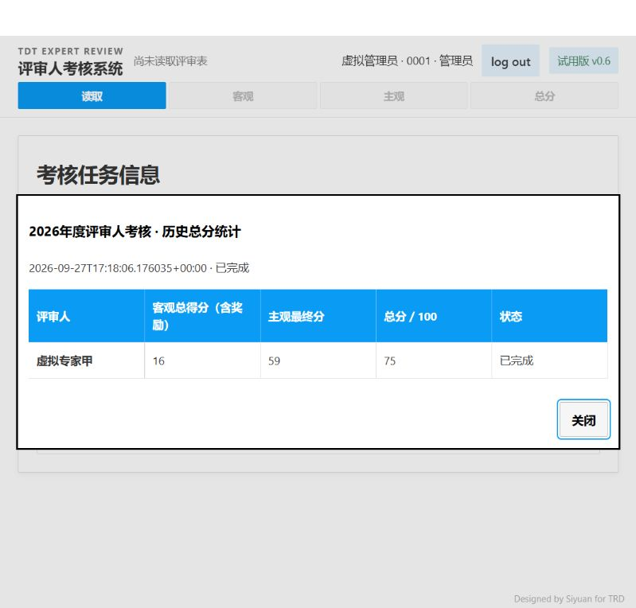

# 多人考评正式集成验收

本轮按已确认的 Demo V6 实现正式功能，以 main `7286541` 为设计基线。开发分支为 `codex/multi-user-assessment`；合并状态以 ROADMAP 为准。本轮不推送、不部署妙搭、不操作真实账号与业务数据。

## 已实现

- 管理员密码登录、项目经理免密登录；角色由本机账号配置决定。保留每次登录首次进入主观评价的填写须知。
- 年份、年度／上半年／下半年创建任务，导入账号 JSON，置顶新建卡片、倒序任务卡片、双进度与二次确认删除。
- 复用 main 的报告解析、名单匹配、客观统计、六维问卷、详情、模块内分页与 Excel 导出。正常 owner ID 自动匹配，仅异常显示人工确认入口。
- 项目经理仅能填写本人问卷；管理员可按项目经理归属代填、修改、查看前后记录和退回问卷。未增加独立的管理员集中投票模式。
- 客观、主观参数分别在任务卡片中编辑、写回各自 JSON 并重读核验。数值变更保留答案并重算当前任务，其他已有任务保留快照，新任务读取更新后的默认值。
- 首次保存答案、原因或依据后，永久锁定本任务题干、选项含义及依据要求；清空答案不会解锁。分值、权重可在考评完成前调整。
- 范围变更使旧统计失效，重新确认后更新范围，保留任务参数和已有答案。全部有效结果齐备后才允许二次确认完成，历史弹窗独立、只读、无导出，关闭位于右下角。

## 隔离与自动检查

真实浏览器使用 `127.0.0.1:8899`，测试数据在 `var/integration-acceptance-20260928/`，账号、SQLite、密码文件、两份评分配置均独立。只使用虚拟人物和虚拟报告，正式 `var/multi-user/` 及 `config/` 未被验收改写。

Python 回归覆盖登录鉴权、账号文件同步与 owner ID 映射、越权和并发拒绝、问卷修改历史、首次保存锁定、独立配置重算与跨任务隔离、磁盘失败回滚、重启恢复、范围变更、完成门槛、归档只读、删除确认及 Excel 数值。前端 Node 回归覆盖 main 原有表格、筛选、提示、名单、问卷和匹配异常交互。最终数量见 ROADMAP。

新增回归明确检查：选满六项但缺少必填依据时显示 5／6，不能计为完成；数值参数变更后导出的主观 Excel 为 59 分，原问卷选择保持不变。

## 真实页面验收

| 场景 | 实际结果 |
| --- | --- |
| 管理员登录、密码可视、项目经理免密 | 页面通过；项目经理其他三个模块禁用并显示锁 |
| 创建任务、导入账号、重启 | 已创建年度任务，重启后任务及三个虚拟账号保留 |
| 导入两份报告、指定本地报告项目经理、名单匹配 | 两份报告检查通过；异常确认后收起；名单交集为一人，原 main 名单区域保留 |
| 读取与下一步、客观模块 | 保留 main 统计／评分页及原有切换，客观分初始为 15 |
| 主观首次须知、管理员代填 | 首次自动弹出须知；保留左侧选择，成功为第二位项目经理填完六题 |
| 项目经理本人填写 | 仅显示本人评审人；共同项目提示与过程详情仅含 B260001；返回列表显示已保存 6／6；重启后仍保留 |
| 参数联动 | 两份问卷完成后，题干及依据规则只读；主观准备高档 10→9 后主观分 60→59；客观出勤 5→6 后客观分 15→16；总分 75；两份原答案保留，两个文件分别写入成功 |
| 范围调整 | 增加第二位评审人后旧统计入口失效，重新确认后第二人主观分与总分留空，完成按钮禁用；恢复原名单后仍为 16＋59＝75 |
| 完成与历史 | 取消确认保留进行中；确认后卡片已完成，历史弹窗为 16、59、75，无导出和参数修改入口；重启登录后历史结果一致 |
| 删除任务 | 取消后卡片保留；确认删除本轮虚拟任务后卡片移除。后台为持久化删除标记，不删除数据库文件 |

浏览器曾拒绝自动文件上传，用户分别手动选入账号配置、两份报告和名单，后续读取及各项页面操作由自动化完成。没有绕过上传拒绝。

## 启动和验证边界

以全新 `cmd.exe` 运行实际 `start.cmd`，使用独立测试工作区，成功启动服务；重复启动复用相同构建和工作区。已有 8865、8888 服务同时运行且未被终止。启动脚本 CRLF 行尾正确；macOS 本轮没有实机验证。

浏览器工具拒绝本轮文件下载，因此本轮未获得浏览器实际下载 Excel 的证据。工作簿生成、接口鉴权及变更后的文件内容由自动回归验证；导出控件与生成流程沿用 main。此限制不能表述为本轮浏览器下载验收通过。

没有调用真实飞书或真实 AI，本轮只验证多人功能与既有模块集成；真实模型识别质量仍沿用 ROADMAP 原有待验证状态。云端持久化与半年度沿用不在本轮范围。
