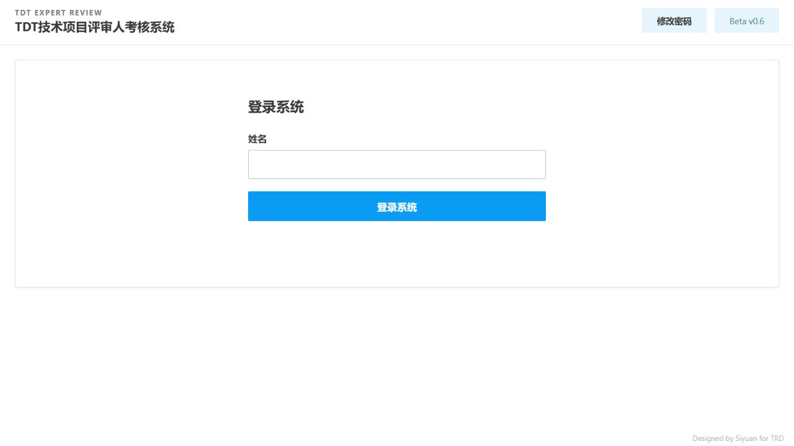
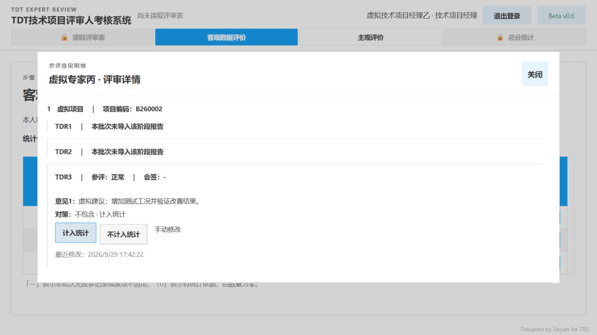

# 2026-09-29已确认修改验收

本机main工作区已实现，构建`7dfbc425a783e50a`。正式服务运行于`http://127.0.0.1:8865/`，虚拟数据验收使用独立8898服务，验收后已停止；真实密码未修改。本轮未提交或推送Git。

## 实现范围

- 首次输入姓名、记住本人账号、取消公开下拉名单；工号保留后台，管理员继续密码校验。默认名单与运行账号合并为`config/project-managers.json`，新任务默认读取，也保留配置导入。
- 管理员角色不分配技术项目经理问卷。统一界面术语为「技术项目经理」。任务名单变更保持客观数据和历史答案不变。
- 技术项目经理可看本人报告／场次的客观统计，包括缺席，并修改本人对策判定；服务端拒绝他人报告修改及客观评分接口。管理员仍看全量统计。展示裁剪不改变全量事实或计分。
- 右上角「退出管理员修改」与修改记录并列；未退出时切模块、经理、评审人或主观打分页弹出指定提醒。「了解」只关闭提醒，不释放修改状态；明确退出后自动保存并恢复经理填写。
- 主观平均计分规则合并到标题旁提示；删除数据留存备注和总分试算凭据常驻行，保留实际错误、保存状态和计分依据入口。
- 报告扫描实际进度随任务持久保存。旧报告按可确认的错误检查点恢复进度；无法确认的旧读取失败显示未记录，不虚构百分比。重新打开不再统一回落0％。
- 与自动判断不同的人工对策选择在选项旁标记「手动修改」。`var/multi-user/countermeasure-corrections.jsonl`保留自动判断、原因、来源、意见原文、操作者、时间和修订历史；疑似确认与纠正分开记录，改回原判断也保留历史。
- 每日备份生成、完整性校验和替换成功后清理旧每日副本，正常只保留最近一份。实时数据库保留完整历史。迁移前一次性恢复副本另存，不纳入每日清理。

## 验证结果

319项Python测试、13个Node回归脚本、前端语法及差异空白检查通过。新增覆盖同项目编码不同报告的隔离、缺席保留、全量评分不变、越权拒绝、人工修订落盘失败回滚、重启恢复、每日备份失败保留、统一配置及内部关联保留。

真实浏览器在独立虚拟工作区验证：

1. 姓名登录、退出后仅本人姓名、管理员密码、首次主观须知保留。
2. 经理甲只见本人TDR1／TDR2；经理乙只见本人TDR3。均无客观打分页、导出或AI操作入口。
3. 人工计入对策后统计刷新，出现手动修改标记，学习记录包含原自动结果及操作者，重启后保留。
4. 管理员四类切换均被拦截；点击了解仍拦截，退出修改后可进入主观打分页，答案保留。
5. 标题提示合并、无数据留存和试算常驻行，未完成时完成考评按钮禁用。
6. 错误报告关闭再打开及服务重启后显示50％和错误色，成功报告100％。
7. 主观参数入口正常，问卷开始后文字规则锁定；无需重复上传配置即可新建2027虚拟任务。
8. 最终正式构建登录页无下拉列表、无工号，服务身份和构建匹配。

## 本机数据核对

统一配置包含20个原账号、3个启用管理员；旧运行名单已归档。30个任务的报告事实、问卷答案和已完成快照逐项保持一致。仅2个进行中任务同步管理员角色，不再向管理员分配经理问卷。两项已确认任务的客观得分迁移前后逐项相同。每日备份剩余1份，迁移凭据见本机`var/multi-user/unified-directory-receipt.json`。

## 验收边界

本轮验收为Windows本机版，未部署妙搭，未验证飞书自动登录或真实AI识别质量。记住姓名是本机便利入口，不证明操作者身份。原导入和导出生成逻辑由现有回归覆盖；本轮未重复上传真实报告或下载真实评分Excel。长期稳定性不能由一次验收作绝对保证。

