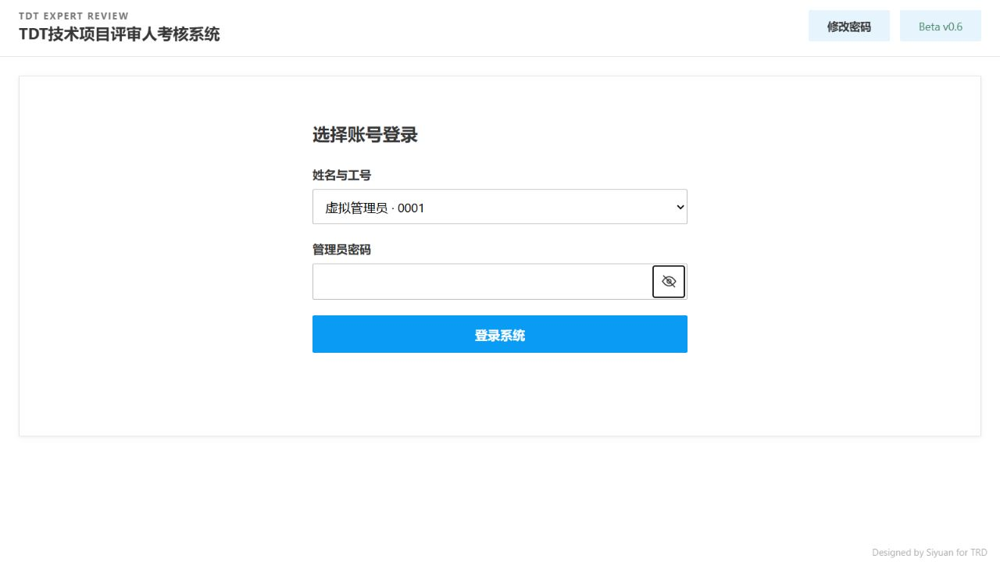
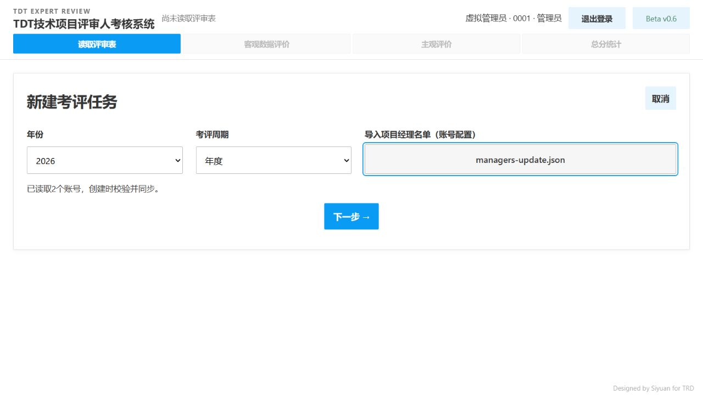
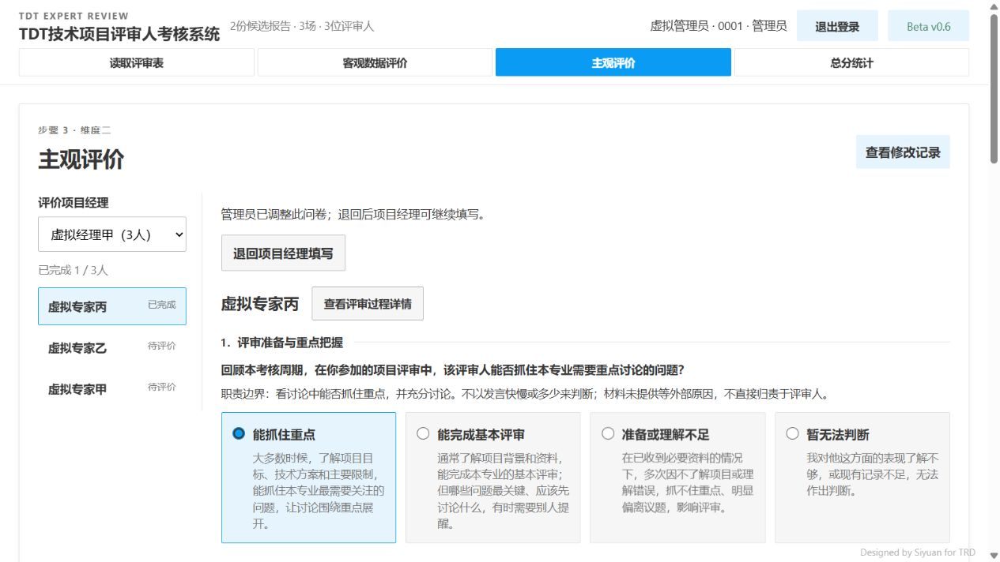

# 输入与问卷交互验收

日期：2026-09-29。

## 交付范围

- 页面标题及浏览器标签更名为「TDT技术项目评审人考核系统」。
- 登录及修改密码弹窗的眼睛内嵌输入框右侧；按住显示，松开、移出、失焦或切换页面后隐藏。键盘空格及回车支持按住查看。
- 新建任务及修改项目经理名单采用整条居中的文件选择按钮；选择后居中显示文件名。
- 问卷取消常驻手动保存，保持自动保存及切换前提交；失败保留当前内容并提供「重试保存」，未保存关闭页面仍提醒。
- 管理员「查看修改记录」置于问卷右上角，沿用既有记录展示，主观打分页隐藏。

## 验证证据

11个Node回归脚本通过，新增覆盖密码按住／释放、移出／失焦／取消、事件清理、文件名呈现以及失败重试状态。9项前端资源测试、前端语法及差异空白检查通过。

真实浏览器使用8899端口及独立`var/input-controls-acceptance-20260929/`虚拟工作区，不修改正式数据、账号或密码。

1. 标题完整显示，右上角账号、退出登录与Beta标识布局正常。
2. 登录眼睛无独立边框，键盘按压释放后输入框恢复密码类型。持续按压中间态及异常释放分支由事件回归验证，未在浏览器逐帧采集。
3. 整条文件选择成功调用选择器，并导入此前已授权的虚拟名单；显示文件名居中，按钮宽度与容器一致。未因此创建额外任务。
4. 首次主观须知仍弹出。六题在模拟两秒保存响应延迟下自动保存为6／6，页面没有「保存问卷」按钮。
5. 右上角查看修改记录成功显示虚拟管理员修订记录。切至主观打分页隐藏入口，返回问卷恢复。
6. 切换其他评审人再返回，原问卷仍为6／6已完成、已保存。浏览器控制台无错误。

本次未重复实际密码变更、正式业务文件导入或云端部署；浏览器保存失败分支未重复制造，由前端回归覆盖。

## 页面留图

