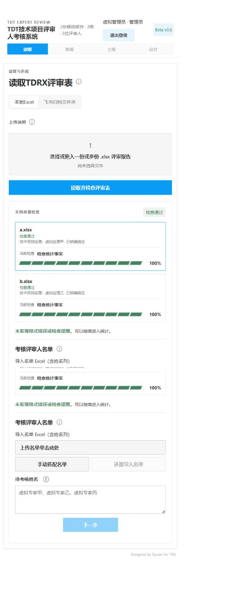

# 2026-09-29报告确认恢复验收

## 根因与修改

首次解析时，总检查和单报告检查项可共享同一Python对象；保存为JSON再加载后，它们成为独立对象。确认姓名相似提醒原来只更新总检查，单报告仍保留error，页面据此出现「总错误0、行进度红色」的矛盾。

在服务加载及持久化的报告恢复流程中，用总检查里已经明确确认的同一confirmation_key恢复单报告的severity、confirmed_by_user及confirmed_at。仅处理已确认的reviewer_name_similarity，不屏蔽其他错误，也不凭100％进度判断检查通过。旧任务再次载入即可恢复显示，无需重新上传；没有执行数据库迁移。

## 验证

- 新增3项回归：先保存再确认后重启；旧总记录已确认但单报告仍error；尚未确认不得清除错误。前两项在修改前失败，修改后通过。
- 共49项相关服务、导入、个人范围及报告恢复测试通过，差异空白检查通过。
- 独立8898工作区仅使用虚拟账号及报告，真实浏览器验证已确认报告为绿色100％，退出登录、重新登录、从任务卡重新进入后仍为绿色。DOM状态为is-ok，颜色为主题绿色#448361。
- 未确认对照任务仍为is-error及主题红色#d44c47；实际点击「确认均为不同人员」后显示检查通过。未掩盖其他错误的分支由回归测试覆盖。浏览器控制台无错误。
- 对实际任务只读解析并在内存应用恢复：5份陈旧错误行变为0；sessions、experts、assessment、manager_reviews逐项相同。未直接写入真实数据库、名单或问卷。
- 正式新构建fb990c083bfc8e98在8867启动，健康接口的项目与工作区身份正确。旧进程仍在，用户需从新地址重新登录；虚拟浏览器验收不代表已操作真实管理员问卷。

## 另一个问题的只读结论

管理员问卷页的经理列表来自本任务的主观分配结果，没有最多5人的限制。实际21份报告识别出9位不同所有者，其中2人的旧绑定指向管理员，1人本身是管理员，另1人与选定评审人的实际参评项目没有交集，结果为5人。现有绑定优先于按姓名建立新绑定，旧错误关联因此被保留；不能据此断言它发生于本次配置导入。

只在内存纠正两处关联的预演结果为7位经理，分别新增1份、2份问卷任务。没有修改真实配置、任务快照或既有答案；用户要求先确认后修改，因此第二项保持待确认。
