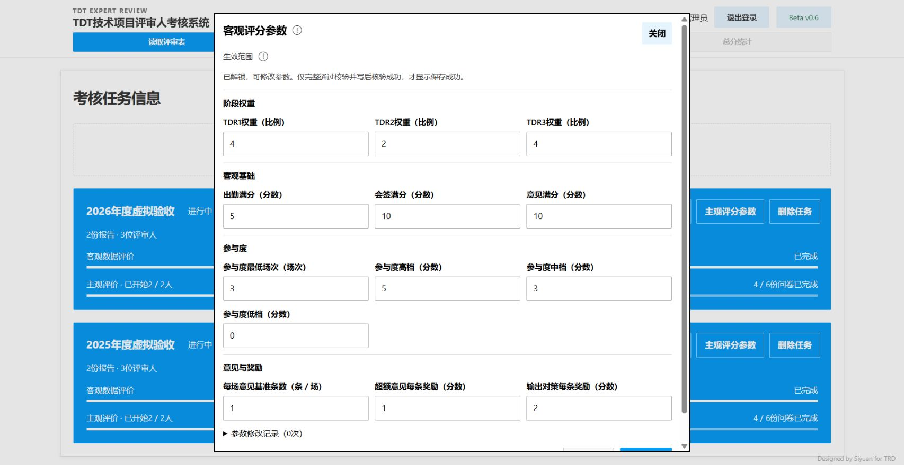
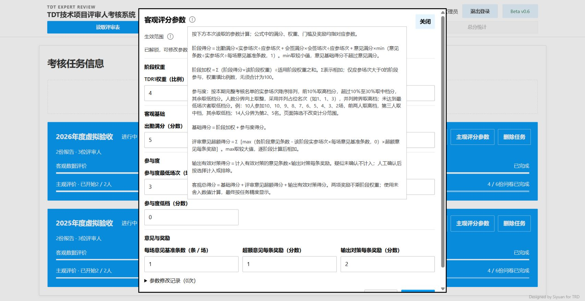
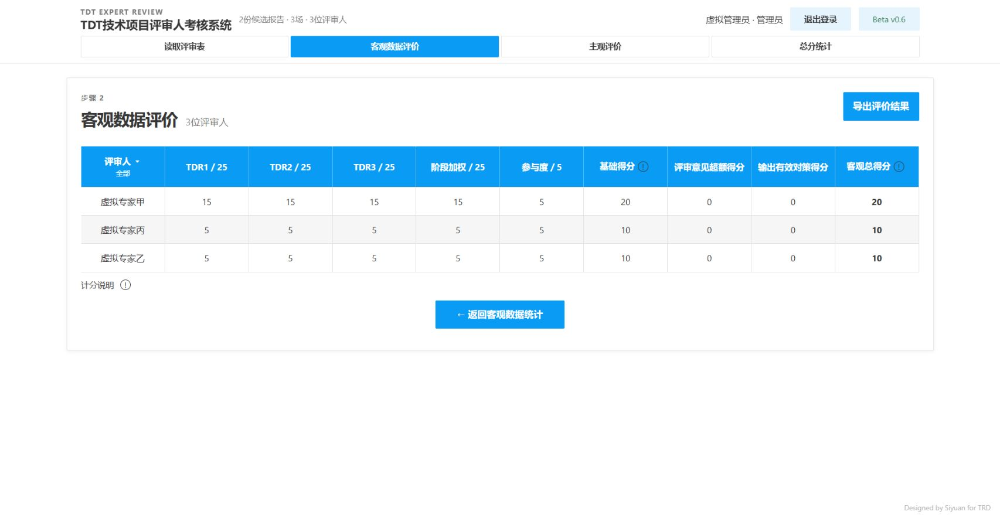
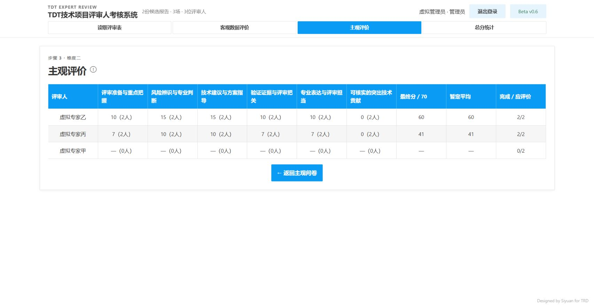

# 参数说明、参与度与打分页排序验收

日期：2026-10-01。计分规则：scores-v0.10。

## 本次范围

- 参数页标明比例、场次、条／场、分数单位；客观基础与参与度独立分组。
- 标题旁使用既有圆圈提示，说明阶段计分、权重归一、参与度、两项奖励及客观总分；主观参数分值同样标明单位。
- 参与度按完整名单实参场次降序、并列占位，人数的10％与30％向上取整为分界，并列跨界取高档；最低场次及档位分值保留任务参数。进行中任务实时重算，新任务沿用新规则，已完成任务读取归档结果。
- 主客观打分页按各自最终分降序；同分稳定，无分数置后，零分为有效分数。筛选仅控制显示。

## 自动验证

- 343项Python测试通过，18个Node回归脚本通过。
- 新增用例先在旧算法失败，再于新实现通过：十人10、10、9、8、7、6、5、4、3、2场得5、5、3、0、0、0、0、0、0、0分；14人分界第2、5名；中档边界并列、全体并列、最低门槛、1／2人、空名单、自定义档位、未知出勤及历史结果不可变。
- 实际页面渲染函数回归覆盖主观与客观使用不同分数字段、同分、零分、待统计置后及筛选保留。
- 参数、任务同步、导出相关测试随完整测试执行通过。

## 真实浏览器

使用独立虚拟工作区 `var/policy-help-acceptance-20261001/` 与8897测试服务，不修改正式账号、密码、问卷或参数。

- 两个既有虚拟任务打开参数页，四个分组及13项客观参数单位正确；主观17项分值有单位。
- 标题提示可点击展开，640px宽、约505px高，全部文字可见；默认打开弹窗不自动展开提示。
- 客观打分页显示20、10、10；主观打分页显示60、41、待统计，符合降序。首次主观须知保留。
- 在页面新建2027年度虚拟任务，参数说明同样可用；将最低场次由3改2，预览显示带单位差异，永久保存成功、自动锁定，其他既有任务仍为3。
- 浏览器日志出现一次异步消息通道关闭提示；参数读取／保存、任务创建及分数显示均完成，未将此提示当作业务验收通过或失败的依据。

## 正式数据只读复核

两个进行中任务各14位评审人，新规则分界为第2、5名；当前参数下分别有2人取5分、3人取3分、9人取0分，各4人的参与度相对旧算法发生变化。仅在内存计算，未执行数据迁移或写回正式业务记录。

## 页面证据

未提交或推送Git。新增试算模式为后续事项，本记录不表示该功能已经实现。
